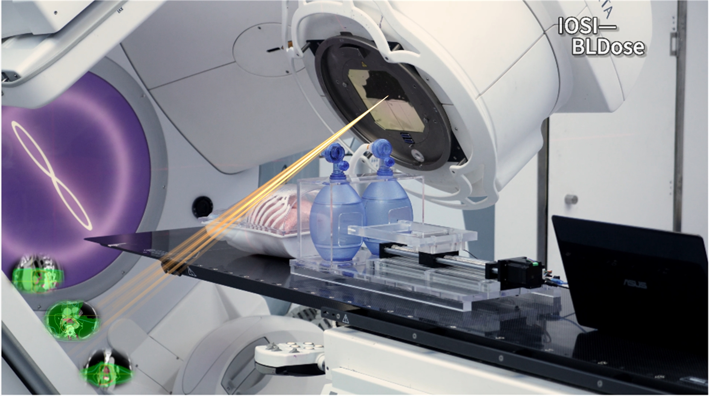

# README

# 3D-BioLungEx & IOSI-BLDose 项目简介

本项目旨在推动放射治疗（放疗）技术的创新，通过开发一套硬件系统与一套软件算法，提升放疗的精确性与效果。

## 🧪 硬件系统：3D-BioLungEx
我们设计了一种三维生物离体运动模拟装置（3D-BioLungEx），用于模拟人体肺部的呼吸运动。该装置包含以下模块：
- **监测模块**：实时监测生物样本的运动状态。
- **模拟模块**：根据监测数据模拟人肺的呼吸运动。

两个模块的源代码均已公开。

---

## 💻 软件算法：IOSI-BLDose

我们开发了一套基于迭代优化与散射反演的生物肺剂量分布逆向解析算法（IOSI-BLDose），用于计算放疗过程中生物组织内的三维剂量分布。该算法有助于提升放疗的精准度与治疗效果。

算法源代码也已公开。

---

## 🌐 项目信息

- **项目目标**：探索放疗新技术，提升治疗精度与效果。
- **开源状态**：硬件与软件部分均已开源。
- **适用领域**：放射治疗、医学物理、生物医学工程。

---
[观看演示视频](movie/Low quality version-demonstration of 3D-BioLungEx and IOSI-BLDose.mp4.mp4)
<video controls width="600">
    <source src="movie/Low quality version-demonstration of 3D-BioLungEx and IOSI-BLDose.mp4.mp4" type="video/mp4">
</video>

如果想要进一步了解或参与本项目，欢迎访问我们的代码仓库或联系项目团队。

--- 

